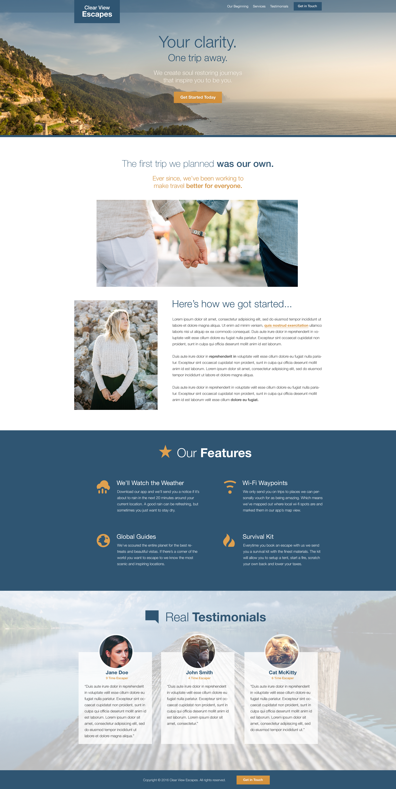

# Travel Site Landing Page

This is a demo landing page for a travel agency. It has some animations as well as responsive and lazy loading images. Here’s a design image:

The website is responsive. Feel free to customize it as you like!

Some important commands to get started are:
- `gulp watch`: Tracks changes in js, css, and ejs files and refreshes the browser as needed (using Browser Sync)
- `gulp build`: Builds dist folder

Enjoy coding!

Note: This was an exercise I completed as part of the course _Git a Web Developer Job: Mastering the Modern Workflow_